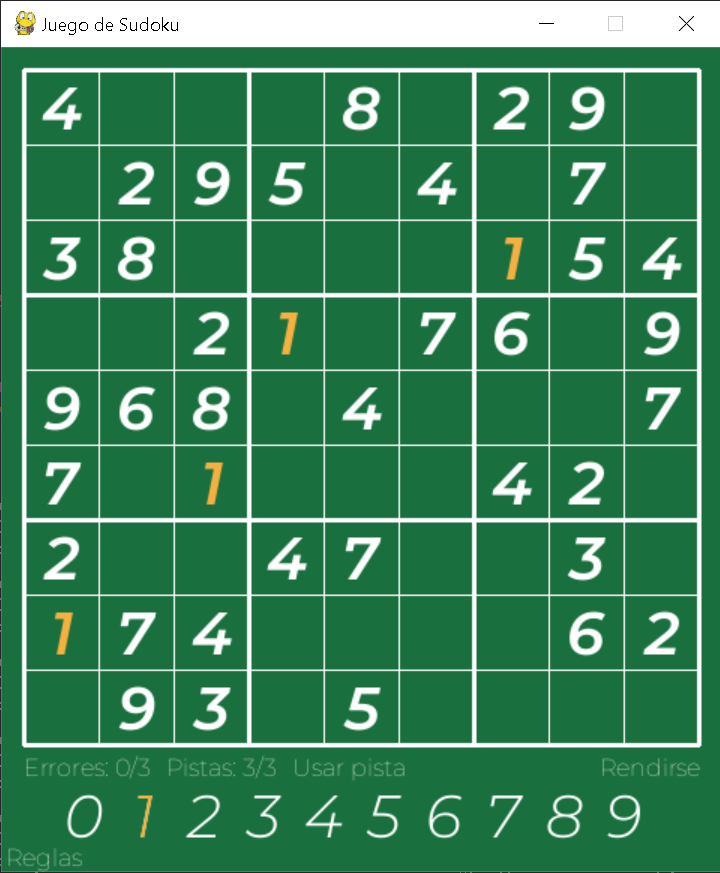
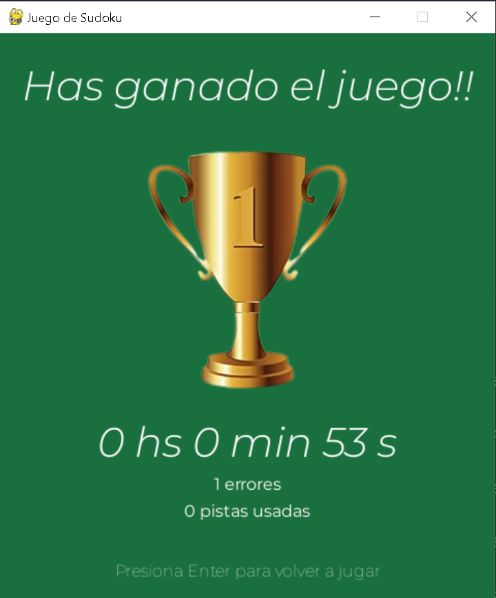

# Juego de Sudoku

### Acerca del Proyecto
El **Juego de Sudoku** es un proyecto de primer año de la carrera de **Ingeniería en Informática**, desarrollado como parte de la materia **Introducción a la Informática**. Esta aplicación es una implementación del famoso **puzle de Sudoku**, desarrollado en el lenguaje de **Python** utilizando la librería **Pygame**.

El objetivo del proyecto fue crear una aplicación interactiva que permita al usuario disfrutar del juego de Sudoku en una interfaz cómoda, intuitiva y funcional, brindando una experiencia de juego fluida y sin complicaciones.

### Características principales
- **Interfaz gráfica** desarrollada con la librería **Pygame** para una experiencia visual atractiva.
- **Generador de sudokus aleatorios** con distintos niveles de dificultad (fácil, medio, difícil).
- **Funcionalidad de pistas**, que permite al usuario recibir sugerencias para completar el tablero en caso de duda.
- **Funcionalidad de visualización de errores**, que permite a los usuarios visualizar sus errores en el tablero.
- **Interactividad intuitiva** que permite a los usuarios seleccionar y editar las celdas de manera sencilla.
- **Lógica del juego** que asegura la correcta validación y resolución del tablero.

### Instalación
Clona el repositorio:
  ```
  git clone https://github.com/usuario/nombre-repositorio.git'
  ```

### ¿Cómo jugar?
Para jugar simplemente ejecuta el archivo
  ```
  python main.py
  ```
   
### Contribuciones
Las contribuciones son bienvenidas. Si deseas contribuir al proyecto, sigue estos pasos:
1. Haz un fork del repositorio.
2. Crea una nueva rama para tus cambios:
  ```
  git checkout -b nueva-rama
  ```
3. Realiza tus cambios y haz un commit
4. Sube tus cambios:
  ```
  git push origin nueva-rama
  ```
5. Crea un pull request detallando tus cambios.

### Gracias por ver
Aquí algunas capturas del juego:
<div>
  
  
  
</div>
